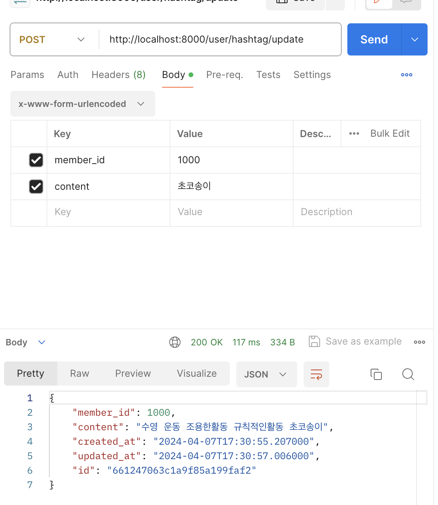
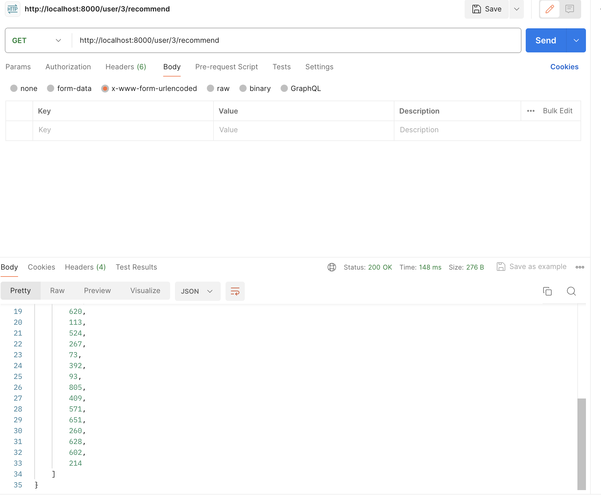

# AI

> glue 서비스의 AI service 부분

```
fast api가 첨이라 파일 구조가 엉망입니다,,
```

### 서비스 종류
- 유저 추천 서비스
- 스티커 생성 서비스

### 더미데이터
사용자 해시태그 데이터
해당 데이터 몽고디비에 먼저 올린 후 추천은 진행하였습니다.

### secrets.json
딱히 시크릿하진 않지만 참고 자료에서 이렇게 처리하길래 따라했습니다.
현재는 로컬 환경에서 만들어놔서 이렇게 처리하였ㅅ브니다.
아래 코드로 해당 json 파일 만들어주시고 내부 요소들은 각자 로컬 DB에 맞게 설정해주셔야 합니다.
```
{
    "MONGO_DB_NAME":"kea",
    "MONGO_DB_URL":"localhost:27017"
}
```

### API 종류
#### 해시태그 생성 및 업데이트
@app.post("/user/hashtag/update")


#### 해시태그 기반 유저추천
@app.get("/user/{member_id}/recommend")


기타사항은 노션에 좀 더 자세히 정리해두겠습니다~
아직 스티커 제작은 구현XX